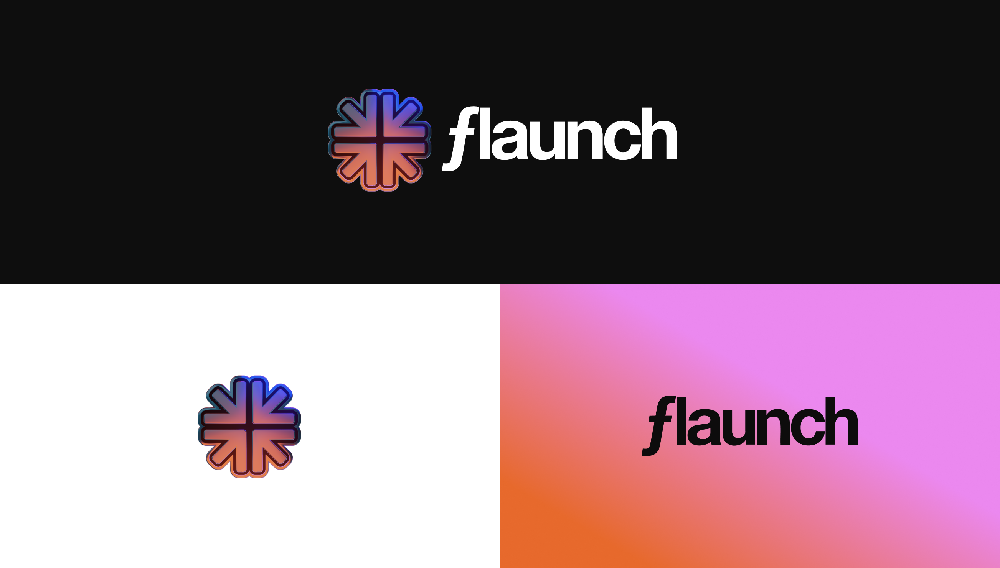

# Brand Kit

### **Logo**

<figure><figcaption></figcaption></figure>


Logos


### Color Palette

<table data-view="cards"><thead><tr><th></th><th data-hidden data-card-cover data-type="files"></th></tr></thead><tbody><tr><td>Blue Hex: #4BA5F2</td><td><a href="../.gitbook/assets/Blue.png">Blue.png</a></td></tr><tr><td>Pink Hex: #EB88EF</td><td><a href="../.gitbook/assets/Pink.png">Pink.png</a></td></tr><tr><td>Orange Hex: #E7692C</td><td><a href="../.gitbook/assets/Orange.png">Orange.png</a></td></tr><tr><td>Yellow Hex: #EFBC41</td><td><a href="../.gitbook/assets/Yellow.png">Yellow.png</a></td></tr><tr><td>Gradient Hex: #E7692C - EB88EF</td><td><a href="../.gitbook/assets/Gradient-1.png">Gradient-1.png</a></td></tr></tbody></table>

### Typography

<table data-view="cards"><thead><tr><th></th><th data-hidden data-card-cover data-type="files"></th></tr></thead><tbody><tr><td>Headings POI Carbonic</td><td><a href="../.gitbook/assets/Headings.png">Headings.png</a></td></tr><tr><td>Body Suisse Int'l</td><td><a href="../.gitbook/assets/Body.png">Body.png</a></td></tr></tbody></table>

### Icon Variations

<figure><figcaption></figcaption></figure>


Icon Variations

