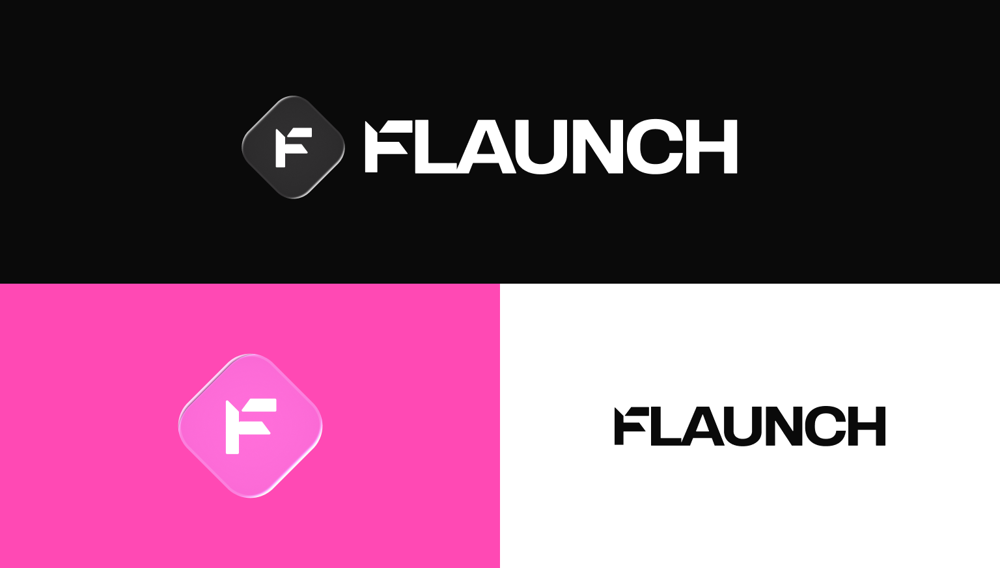

# Brand Kit

### **Logo**

<figure><figcaption></figcaption></figure>



### Color Palette

<table data-view="cards"><thead><tr><th></th><th data-hidden data-card-cover data-type="image">Cover image</th></tr></thead><tbody><tr><td>Magenta Hex: #FF49B4</td><td><a href="../.gitbook/assets/magenta.png">magenta.png</a></td></tr><tr><td>Purple Hex: #B280FF</td><td><a href="../.gitbook/assets/purple.png">purple.png</a></td></tr><tr><td>Black Hex: #0A0A0A</td><td><a href="../.gitbook/assets/black.png">black.png</a></td></tr><tr><td>Blue Hex: #00B6DD</td><td><a href="../.gitbook/assets/Blue.png">Blue.png</a></td></tr><tr><td>Emerald Hex: #00A473</td><td><a href="../.gitbook/assets/emerald.png">emerald.png</a></td></tr><tr><td>White Hex: #FFFFFF</td><td><a href="../.gitbook/assets/white.png">white.png</a></td></tr></tbody></table>

### Typography

<table data-view="cards"><thead><tr><th></th><th data-hidden data-card-cover data-type="image">Cover image</th></tr></thead><tbody><tr><td>Headings BB TORSOS</td><td><a href="../.gitbook/assets/bbtorsos.png">bbtorsos.png</a></td></tr><tr><td>Body Basier Circle</td><td><a href="../.gitbook/assets/basier.png">basier.png</a></td></tr></tbody></table>
