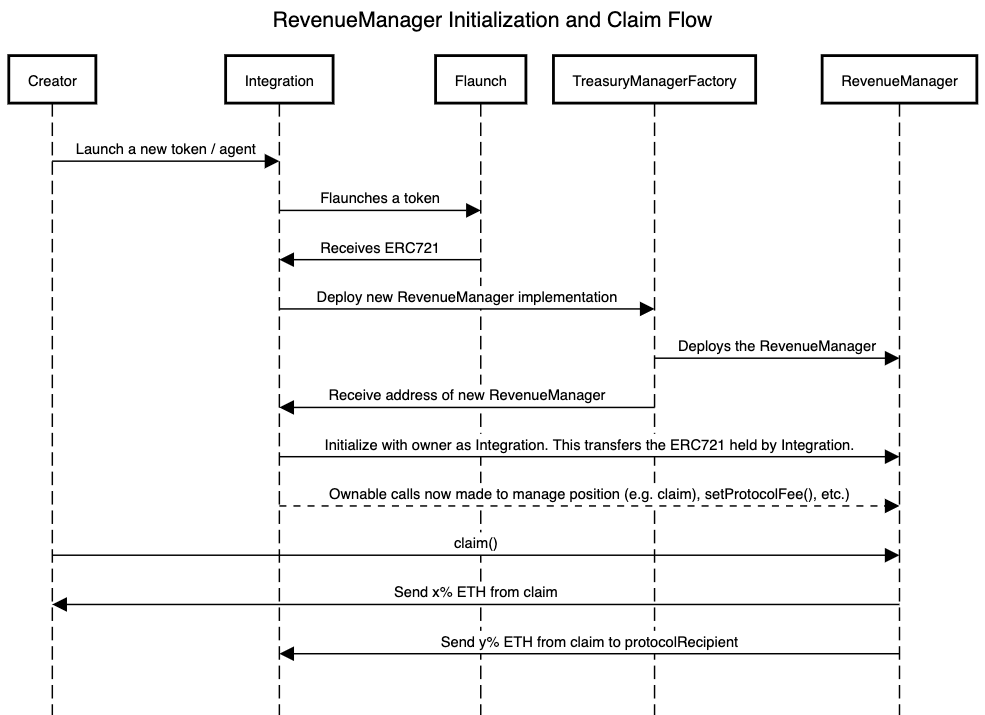

# RevenueManager

If you operate an external protocol, there are a number of benefits that can come from integrating with Flaunch.

1. Create your own launchpad that gives you full control of the business model
2. Integrate your protocol's functionality into Flaunch's whitelisted treasury actions to build TVL
3. Build popular money games with the tokenized revenue streams and profit
4. Builders can take up to 100% of all fees generated, and the remaining will go to your token creator and [the community](../hooks/progressive-bid-wall.md).

The Flaunch protocol is built in a way that directly rewards the token creator though, which won't benefit an external protocol. To alleviate this issue, we can use an escrow contract that will captures fees as a middleware and give more granular control over fee distribution in any way wanted.

To achieve this, we created the `RevenueManager` implementation contract that is simple to integrate. Before making your call to [flaunch a token](../guides/flaunching-a-coin.md) you will first need to [deploy an implementation of the Treasury Manager](./) and then initialize the `RevenueManager` like below.

```solidity
/**
 * Parameters passed during manager initialization:
 *
 * @member creator The end-owner creator of the ERC721
 * @member protocolRecipient The recipient of protocol fees
 * @member protocolFee The fee that the external protocol will take (2dp)
 */
struct InitializeParams {
  address payable creator;
  address payable protocolRecipient;
  uint protocolFee;
}

/**
 * Initialize our manager. This will transfer the token from this address
 * to the deployed treasury manager contract. The owner should be the contract
 * that will handle the middleware management. This will likely be the same
 * contract that is making the flaunch call.
 */
ITreasuryManager(_manager).initialize({
  _tokenId: tokenId,
  _owner: address(this),
  _data: abi.encode(
    InitializeParams({
      creator: msg.sender,
      protocolRecipient: address(0x123),
      protocolFee: 1000  // Taking 10%
    })
  )
});
```

It's as simple as that! Calls to claim fees can now be made via the unique escrow contract for each token, stored onchain and routed how you see fit. The `_owner` will also have some protected calls made available.

<figure><figcaption><p>RevenueManager Initialization and Claim Flow</p></figcaption></figure>


If you are handling swaps externally of Flaunch, it may be worth setting up [referrer detection](../guides/setting-a-swap-referrer.md) in your swaps for additional protocol revenue.


### Routing Fees

As the ERC721 is owned by the manager fees will now be allocated to the manager contract, rather than the original creator. The `claim` call can be made at any time and will withdraw fees allocated to the manager and split it between `protocolRecipient` and the creator.

```solidity
/**
 * Calls `withdrawFees` against the {PositionManager} to claim any fees allocated to this
 * escrow contract. If a protocol recipient has been set, then the revenue is split first
 * before being sent to the end-owner.
 *
 * @return creatorAmount_ The amount received by the end-owner
 * @return protocolAmount_ The amount received by the protocol
 */
function claim() public returns (uint creatorAmount_, uint protocolAmount_);
```

If the ETH from the claim cannot be transferred to either the creator or the protocol, this claim call will not revert. However, this will just be reflected in the returned values and the emitted events. The ETH will remain in the contract until the next claim.

The `RevenueClaimed` event is also emitted during the claim call which can be tracked to provide ongoing information regarding claims.

```solidity
event RevenueClaimed(
    address _creator, uint _creatorAmount, bool _creatorSuccess,
    address _protocol, uint _protocolAmount, bool _protocolSuccess
);
```


The `RevenueManager` can only hold a single tokenId at a time. For this reason, you will be required to initialize new managers for each token flaunched.


### Additional Ownership Calls

In addition to claim routing, the owner of the manager contract (defined when initialising the manager) will have some additional, protected calls available.

```solidity
/**
 * Allows the protocol recipient to be updated. This can allow a zero
 * value that will bypass the protocol recipient taking a protocol fee
 * during the claim.
 *
 * @dev This can only be called by the contract owner
 *
 * @param _protocolRecipient The new protocol recipient address
 */
function setProtocolRecipient(address payable _protocolRecipient) public onlyOwner;

/**
 * Allows the end-owner creator of the ERC721 to be updated by the
 * intermediary.
 *
 * @dev This can only be called by the contract owner
 *
 * @param _creator The new end-owner creator address
 */
function setCreator(address payable _creator) public onlyOwner;

/**
 * Allows the protocol recipient to be updated. This percentage value is
 * accurate to 2dp and must be less than, or equal to, 100% (100_00).
 *
 * @dev This can only be called by the contract owner
 *
 * @param _protocolFee The new protocol fee
 */
function setProtocolFee(uint _protocolFee) public onlyOwner;

/**
 * Rescues the ERC721, extracting it from the manager and transferring it
 * to a recipient.
 *
 * @dev Only the owner can make this call.
 *
 * @param _tokenId The tokenId to rescue
 * @param _recipient The recipient to receive the ERC721
 */
function rescue(uint _tokenId, address _recipient) public onlyOwner;

```

### Who is using the RevenueManager?


We are currently working with a small number of launchpads to implement our RevenueManager. When they are released as public code repositories, we will share and document the implementations. Check back soon!


### Deployment Address

<table><thead><tr><th width="343">Chain</th><th>Address</th></tr></thead><tbody><tr><td>Base</td><td><em>Coming soon</em></td></tr><tr><td>Base Sepolia</td><td><code>0x08c2c76fd65866603d7b695971f52ff6d74e25e7</code></td></tr></tbody></table>

### Implementation Source


RevenueManager.sol

