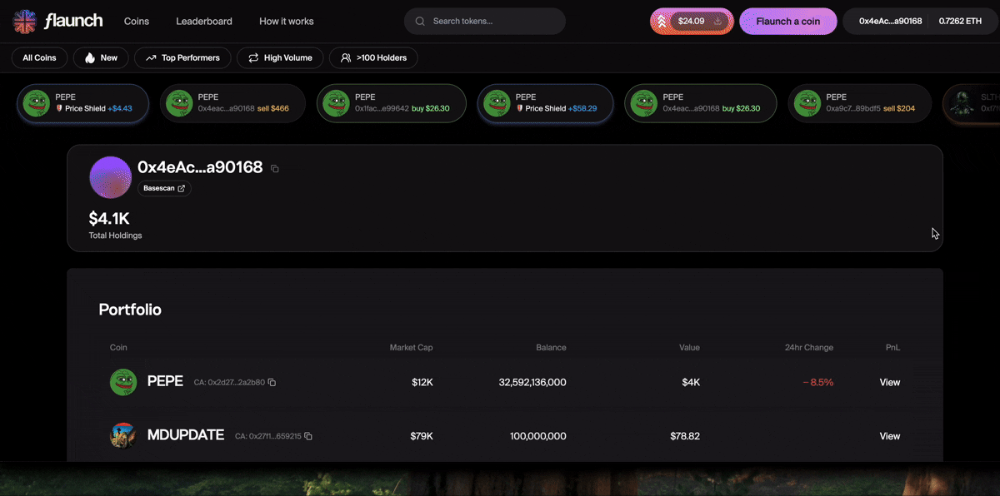

# 27 February: Flaunchy Launched on Farcaster, Update Social Links, New Coin Layout, PnL Snapshots

## Flaunchy launched on Warpcast

You can now launch a token through Warpcast simply by chatting to [Flaunchy](https://warpcast.com/flaunchy).

[Say hello and try it yourself](https://warpcast.com/~/compose?text=Hello%20@flaunchy!%20Can%20I%20create%20a%20memecoin?).... launch tokens for free!

## Update Social Links

When you create a Memecoin you have the option to add social links. Sometimes, however, creators might not have socials setup at the time the memecoin is launched and need to add or update them later.

Click on the "Edit" button next to the icon for Basescan (under the Owner Actions).

<figure><figcaption>
Click on Edit under the Owner Actions
</figcaption></figure>

Update your new social details (note that if you remove your updated details they will revert back to the details you included when creating the memecoin)

<figure><figcaption>
Update your new social details
</figcaption></figure>

Click update and now everyone can access your social links from the memecoin page.

<figure><figcaption>
Your new links are now available
</figcaption></figure>

## New Single Coin Layout

The homepage now celebrates the creator/meme coin owners by sharing the latest claims on the homepage.

The new header ow shows off the amount of revenue earned as part of the split, along with the amount of ETH and Tokens sitting inside of the Treasury.

The Marketcap, Liquidity, Fair Launch starting values and holders are also clearly defined with the past 24 hour volume coming soon.

<figure><figcaption></figcaption></figure>

The transactions table has had a make over as well, now showing both the USD and ETH value of the transaction and a link to the transaction on BaseScan.

<figure><figcaption></figcaption></figure>

The Holders tab now shows the percentage for each holder, along with the amount and a visual bar graph of their position. The Pool Manager (liquidity) has also been added to show the number of tokens locked within the protocol.

<figure><figcaption></figcaption></figure>

## PnL Snapshots

You can now view your current profit and loss on your current portfolio holdings. Navigate to [https://flaunch.gg/portfolio](https://flaunch.gg/portfolio), connect your wallet, and then view your portfolio.

<figure><figcaption></figcaption></figure>

Bug Fixes

* **Fixed token search:** tokens are now searchable via contract address or their name/symbol/description.

New Features

* **ENS and Basenames in the chat**: When chatting users will be able to see your linked .eth or .base.eth user name.
* **Show locked symbol next to LP as a "holder"**: new holder section on the single page coin layout now shows the tokens that are locked in the LP to better illustrate token distribution
* **Proxy Server Performance Improvements**: ongoing tweaks on the API and proxy servers have reduced server load and improved response times.
* **Blur flagged token images**: Any token images flagged as NSFW are now blurred rather than removed.
* **Dune Dashboard Added:** we added a [Flaunch Dune dashboard](https://dune.com/flaunch/flaunch-protocol-dashboard) that pulls all events from the PoolSwap event on the Flaunch Position manager. The ensures Fair Launch and Internal Swap Pool volume are captured (not currently captured within the uniswap dex.trades table).

