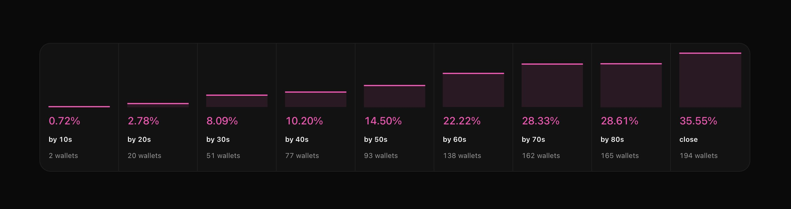
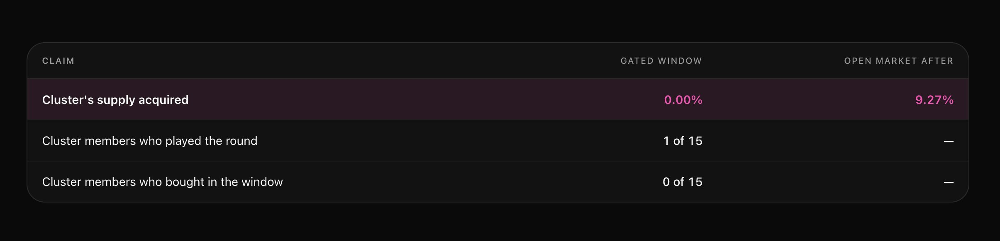
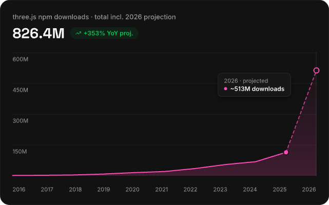

# Game Mode

Flaunch is on a mission to give people fairer access to token launches while maximizing rewards for creators. Game Mode is a new innovation on that mission, powered by our Uniswap V4 hook: a **play-to-enter bonding curve**, the first of its kind. It's egalitarian, it's anti-bot and anti-bundler, and it's the future of token launches.

A fair launch is meant to give everyone the same shot at a coin. In practice the first block goes to whoever has the best infrastructure. Bots watch the mempool, land their buys in the same second the pool opens, and sell into the people who arrived moments later. Technically nothing stopped you from buying; practically the good price was gone before you saw the coin.

Game Mode replaces that race with a **window**. For as long as the window is open, the only way onto the curve is to earn it, by playing a game. Nobody buys before the window opens, and nobody buys more than they earned. When the window closes, the coin trades like any other Flaunch coin.

## How a round works

1. **A coin launches with a window.** The creator schedules the launch and picks the game that will guard it. Until the window opens, every swap against the pool reverts, and that's the pool's own rule rather than something the game server has to enforce.
2. **Players play.** Everyone in the round shares one window and one leaderboard. Scoring happens on the server, which re-runs every move from the player's inputs instead of trusting the browser.
3. **Points become spending power.** Your score converts to an ETH allowance. Score more, buy more, up to a per-wallet cap that applies to everyone equally.
4. **You buy what you earned.** Claiming your allowance produces a signed authorization for exactly that amount. The pool checks the signature and the amount on every swap.
5. **The window closes and the gate lifts.** The coin is now an ordinary coin, trading permissionlessly.

## What you can rely on

These hold because the pool enforces them, not because the game server is well behaved:

* **No buying before the window.** The launch's opening time is written into the pool, so there's no early access for anyone to be given or to buy.
* **No buying more than you earned.** Every authorization names a maximum spend, and the pool measures the swap's real ETH input against it.
* **No buying more than your share.** A per-wallet cap is set at launch and enforced cumulatively, so a player who wins ten rounds of allowance still can't exceed it.
* **The coin reaches the open market on time.** The gate carries an expiry written into the pool at launch. Past it the gate stops enforcing on its own, with no transaction needed from the game server, the creator, or Flaunch.

That last one is the important one. Without an expiry, a coin would need our servers to still be alive to ever trade freely, and holders would be waiting on us instead of on a clock.


Game Mode is live on Robinhood chain. The technical details — the signing service, the contracts, and how enforcement works inside the Uniswap V4 hook — are documented under [Spend-Gated Launches](../developer-resources/spend-gate/README.md).


## What a launch looks like

This is supply distribution through the window of a live Game Mode round, ten seconds at a time:

<figure><figcaption>Ten seconds in: 0.72% of supply, held by two wallets. At close: 35.55%, spread across 194.</figcaption></figure>

Ten seconds is first-block territory — in a sniped launch the whole story has already happened. Here, two wallets held 0.72% of the supply. From there it built the way a launch should: 51 wallets by thirty seconds, 138 by sixty, and 194 wallets holding 35.55% between them when the window closed. Supply was earned, not sniped.

The bundlers still turned up. One cluster of fifteen wallets — the kind built to split a launch buy across itself — bought nothing at all during the window. One of the fifteen tried playing the round; none of them bought. The 9.27% of supply the cluster did acquire was bought on the open market after the gate lifted, at prices the players had already set. For the first time, the players front-ran the bundlers.

<figure><figcaption>The fifteen-wallet cluster: nothing in the window, 9.27% after it.</figcaption></figure>

The full breakdown is in [this thread](https://x.com/flaunchgg/status/2085701754864189580).

## What it changes for creators

Game Mode changes what buyers compete over. Instead of latency, it's skill, knowledge or luck, and instead of a few automated wallets clearing the fair launch in one block, you get a room full of people who spent five minutes earning a position. That's a slower launch and a better holder list, which is the trade a creator is making when they turn it on.

## Why games, why now

Browser gaming is in the middle of a boom. three.js — the library most in-browser 3D is built on, including Split the Arrow — has been downloaded 826 million times from npm, and over half of that is projected to happen in 2026 alone.

<figure><figcaption>three.js npm downloads. The 2026 projection is ~513M — up 353% year on year.</figcaption></figure>

That curve matters for launches because a real 3D game now runs in the same browser tab as the wallet, with nothing to install between a player and a round. Game Mode turns that into launch infrastructure: any dev can gate entry to a token launch with gameplay nobody else has.

## The games

**[Split the Arrow](split-the-arrow.md)** is the first, and it's a real game rather than a buy button with a puzzle bolted to it: 3D archery with wind you have to read, a shot budget, and a leaderboard full of people you can watch shooting. It's playable now.

More are coming from us, but Game Mode is open to anyone's game — a trivia round for a knowledge community, a reflex test, a raffle for a project that would rather gate on luck than skill. Anything that can score a player can issue allowance, and the launch experience becomes whatever the game makes it.

One thing worth being precise about, because it's easy to assume the opposite: the games themselves are never tokenized. A game has no coin of its own, and building one involves no launch. Game developers supply the entrance, creators launch coins through it, and a game in the official library earns a share of the trading fees of every coin that launches through it.

See **[Build a Game](build-a-game.md)** for where that stands, including the open [Game Mode Hackathon](https://flaunch.gg/game-mode/hackathon).
