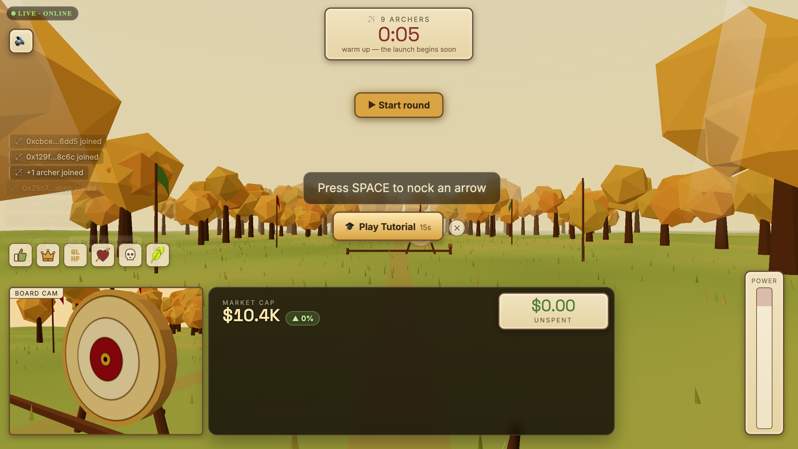
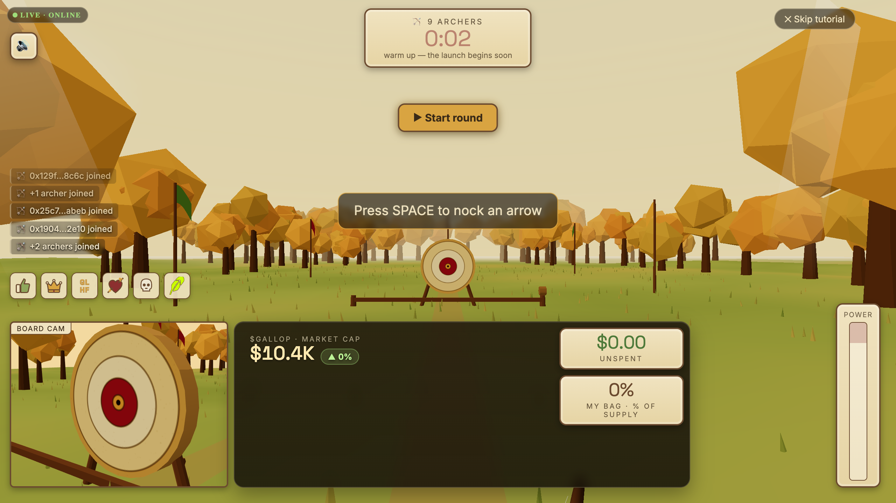
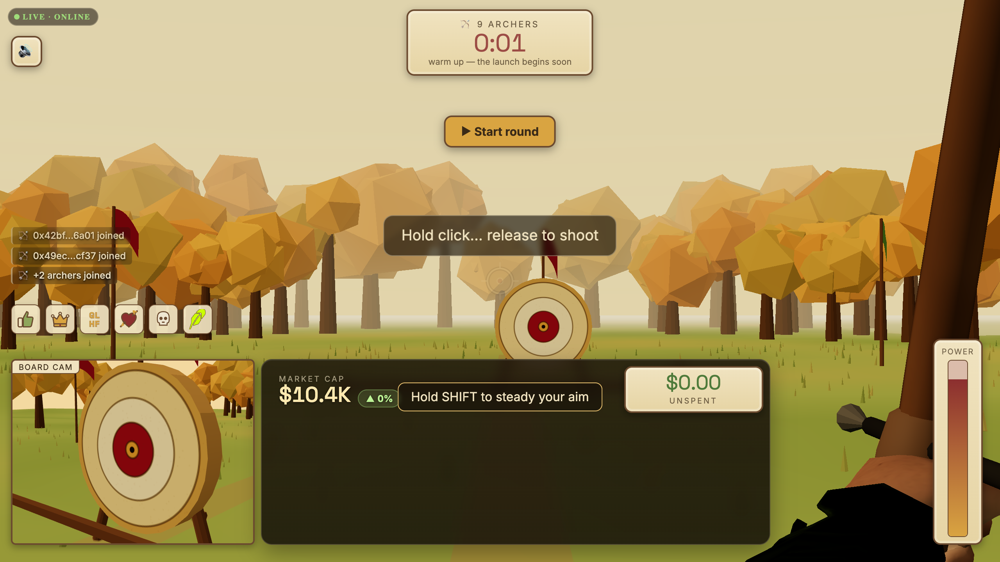
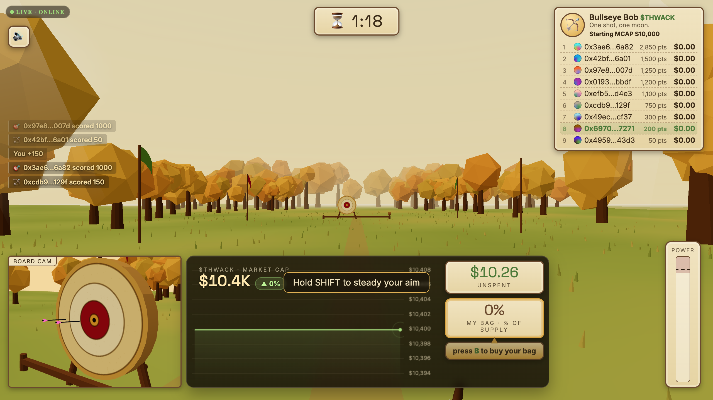
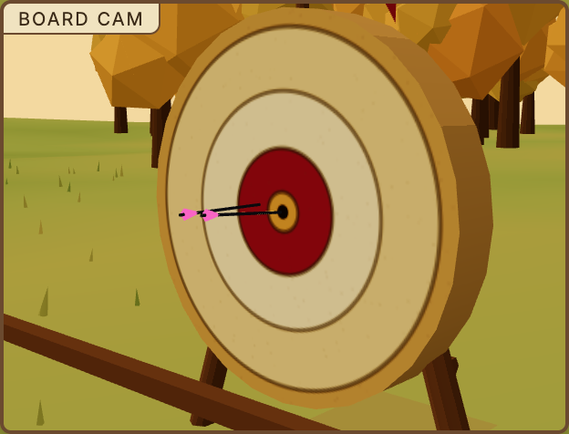
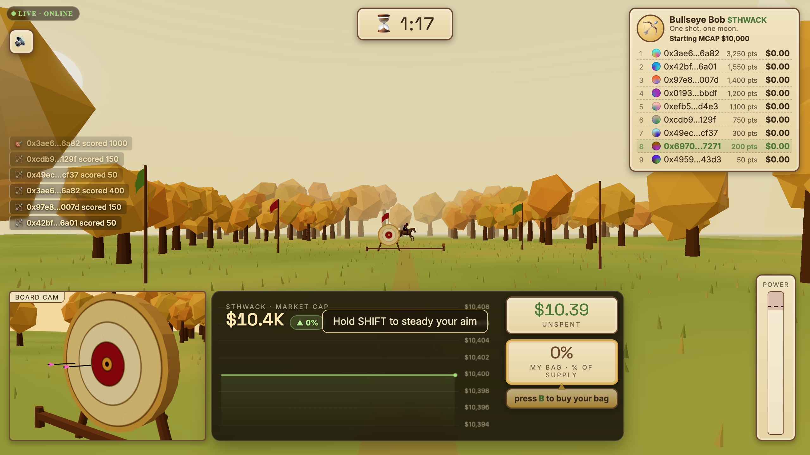
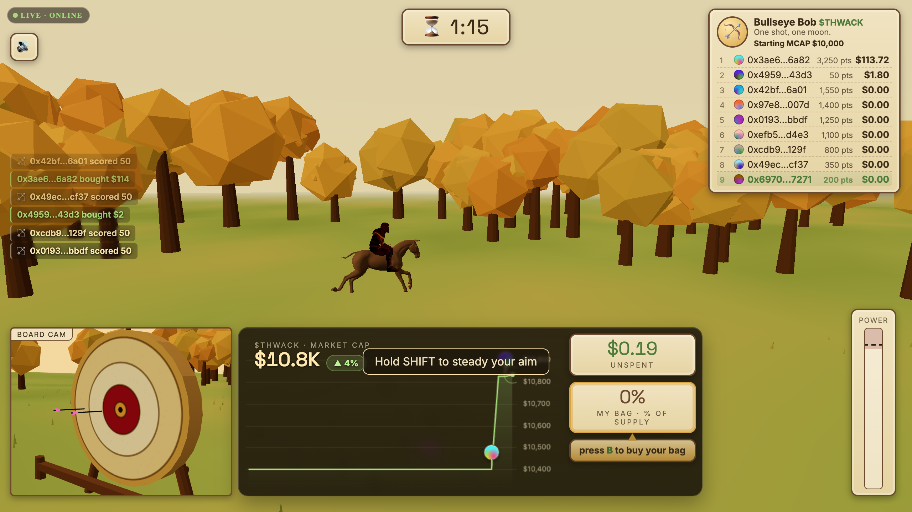
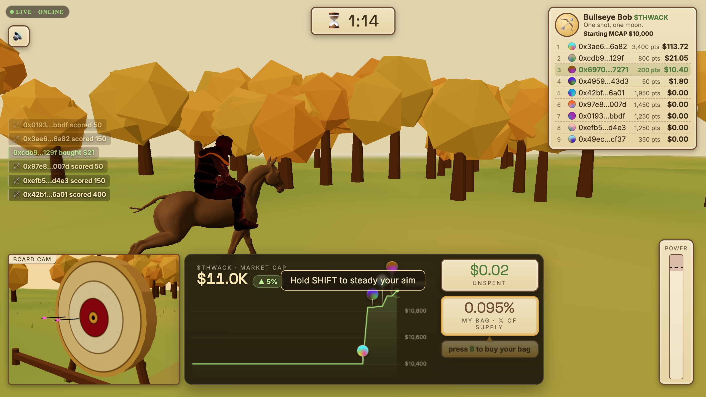
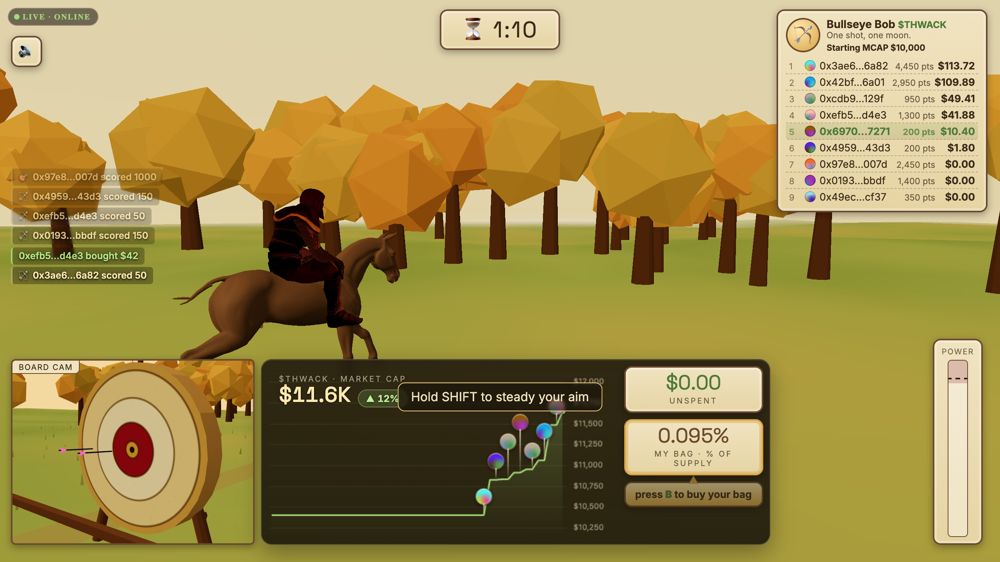
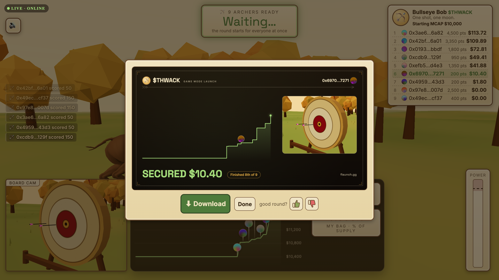

# Split the Arrow

You get sixty seconds and a longbow, shooting at a target thirty-five metres away in gusting wind. Every point you score becomes ETH you're allowed to spend on the coin that's launching. Everyone in the round shoots at the same time, and you can watch them do it.

This page walks through a round as a player sees it. For how the gate works underneath, see [Spend-Gated Launches](../developer-resources/spend-gate/README.md).

## The lobby

A round runs on its coin's page on Flaunch. Open the page and you're in the lobby with everyone else, watching the countdown to the launch window.

<figure><figcaption>Everyone who opens the page lands in the same room. The code in the address bar is the invite.</figcaption></figure>

The room code in the URL is a working invite — send it to someone and they join the round you're in, not whichever round happens to be current when they click. If you leave and come back you return to your own seat, with the same wind and the same score.

You can't shoot yet. Until the window opens, the coin can't be bought at all.

## Nocking, drawing, aiming

<figure><figcaption>The tutorial runs once and can be skipped.</figcaption></figure>

There are only four controls:

| Control | What it does |
| --- | --- |
| **Space** | Nock an arrow |
| **Hold click** | Draw. Power builds for about 1.4 seconds to a full draw, and keeps going into overdraw |
| **Drag** | Aim |
| **Shift** | Hold your breath — freezes the sway for 2 seconds, once per shot |
| **Release** | Shoot |

Your aim sways while you hold a draw, and the longer you hold the worse it gets. Holding your breath freezes the sway for two seconds so you can place the shot, and you get one breath per arrow. Spending it early because the sway looked bad is the most common way to lose a bullseye.

## The wind

<figure><figcaption>The flags are the only wind indicator. Read them before you release.</figcaption></figure>

Wind is where the skill is. It gusts on roughly a seven-second cycle and reverses direction at least once per round, and there's no readout for it — the flags down the range are all you get. A shot that would have been a bullseye in still air lands in the outer ring if you release into a gust you didn't see building.

Every player gets their own wind seed, so the gusts you're fighting aren't the ones the person above you on the leaderboard is fighting. That's deliberate: if everyone shared the same wind, one person could solve it and hand the answer around.

## Scoring

<figure><figcaption>Four rings. The tightest one containing the arrow wins.</figcaption></figure>

| Ring | Points |
| --- | --- |
| Outer | 50 |
| Third | 150 |
| Second | 400 |
| Bullseye | 1,000 |

You have **32 arrows** per round with a short cooldown between shots. At roughly one shot per second you won't run out of arrows inside sixty seconds unless you're trying to.

## Splitting the arrow

<figure><figcaption>The shot the game is named after.</figcaption></figure>

Land an arrow in one already stuck in the board and you split it — the Robin Hood shot. A split **doubles that shot's ring score**, so splitting a bullseye is worth 2,000.

Only the first three splits in a round pay the bonus. After that arrows still split and still score their ring — they just stop doubling. The cap is there because a bot that has solved the wind puts every arrow on the same point by default, and would happily collect the bonus thirty times in a round where no human collects it twice.

## The Taxman

<figure><figcaption>He crosses once. Everyone in the round sees the same ride.</figcaption></figure>

Once per round, the Taxman gallops across the road behind the target. Unhorse him and you take **2,500 points** — two and a half bullseyes, the biggest single score in the game.

He's a hard shot. He's further away than the target, he's moving, and his pace surges rather than holding steady, so leading him takes practice. Unlike the wind, his crossing is shared: everyone in the round sees the same ride at the same moment, which is usually when the reactions bar lights up.

The only cost of trying is the arrow.

## The leaderboard

<figure><figcaption>The whole round, scored live on the server.</figcaption></figure>

Scores update live for everyone. There's no chat — just reactions, which are one tap each, so nobody can shill a different coin at a captive audience.

Every score on the board was calculated on the server. The game re-runs your shots from your inputs and scores what actually happened, not what your browser claimed.

## Buying what you earned

<figure><figcaption>Your score, converted into spending power.</figcaption></figure>

Your score is an ETH allowance, and the BUY button spends it. Press it and the server issues a signed authorization for that exact amount, your wallet submits the swap carrying it, and the pool checks the signature before letting the trade through.

There are two limits: you can't spend more than you earned, and you can't spend more than the per-wallet cap set at launch, which is the same for everyone no matter how well they shot. A very good round will hit the cap — it's what stops the best player in the room from taking the whole float.

<figure><figcaption>Everyone's buys land on the same curve.</figcaption></figure>

Every buy in the round moves the same price. Waiting to buy is a real decision: your allowance doesn't expire inside the window, but the price it buys at climbs with every buy that lands before yours.

## The horn

<figure><figcaption>Your board, ready to share.</figcaption></figure>

When the window closes the round settles and the gate lifts. From then on the coin is an ordinary Flaunch coin — anyone can buy it, no signature required, no game involved.

You keep your board. The results card renders your round as an image, and your best three shots can be pulled out as a replay clip, re-rendered from the same numbers the server scored.

## Playing before you play

Practice rounds are the full multiplayer experience — real roster, real scoring, real opponents — with a simulated economy. Nothing is earned and nothing is bought, so there's no wallet to connect and nothing to sign. It's the right place to learn what a headwind looks like.


Points earned in a practice round are not allowance. Only a live round against a real launch produces something you can spend.

