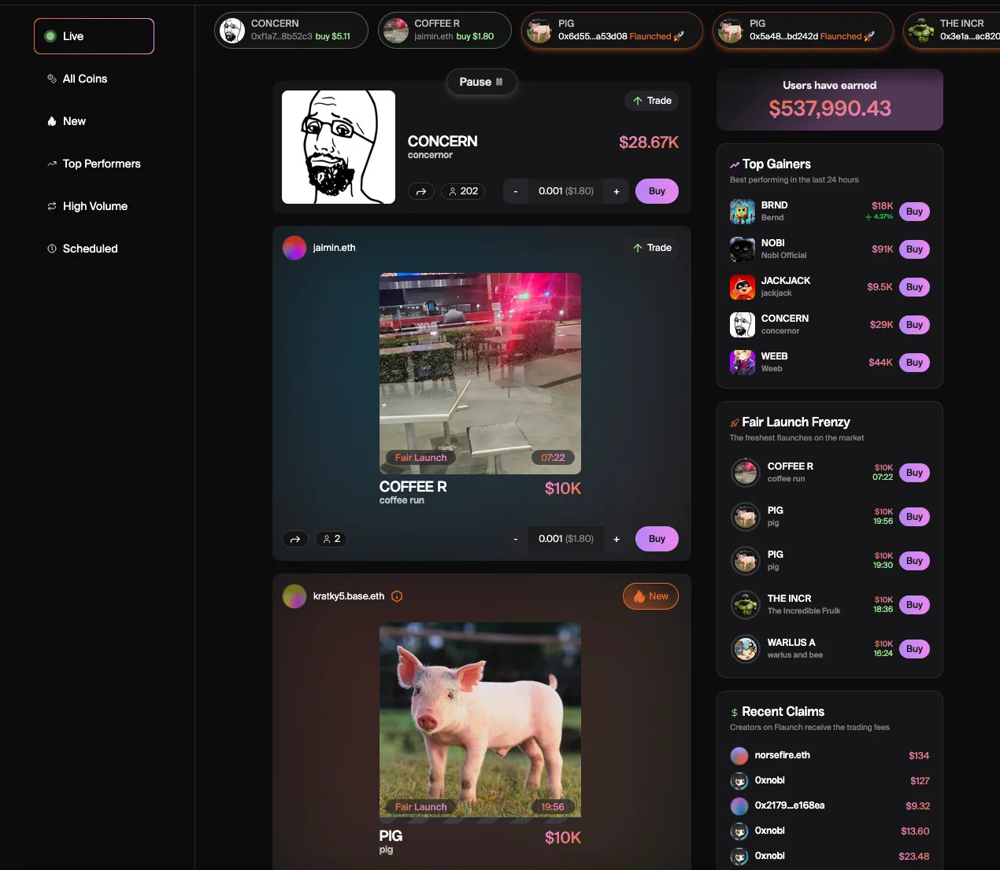

# 13 March: Web2 API, New Homepage, Just Flaunch Launchpad

## Web2 Api

Users can now launch meme coins without needing a wallet or signing a transaction. The Web2 API leverages the Flaunch SDK to launch tokens with specific predefined rules including:

* 10k Market Cap
* 80% Creator Fees
* 20% Buy backs/Price protection

The API enables users to upload images to IPFS and provide coin and creator details before launching. Users can specify either a standard wallet address as the creator or use a Twitter, Farcaster, or email address—which automatically creates an associated wallet address through our Privy integration.

API limits are set on the endpoint (4 images per minute, 2 launches per minute). API keys are available for increased allowances upon request.

Want to know more, [check out the docs](https://docs.flaunch.gg/references/api).

## Homepage timeline updates

<figure><figcaption></figcaption></figure>

We've overhauled the homepage timeline to better showcase platform activity.

The sidebar now features customized sections displaying coins that are pumping in the last 24 hours and all current Fair launch coins, both with instant buy options.

The main feed highlights newly created coins and significant purchases.

## Just Flaunch Launched - a web 2 transactionless token creation

<figure><figcaption></figcaption></figure>

To celebrate and showcase the Web 2 API, we've created a [just.flaunch.gg](http://just.flaunch.gg) landing page where users can launch tokens without needing a wallet.

This demonstrates the power of the Flaunch protocol and its integrations for Web2 users who have no existing wallets or crypto experience but can still participate.

