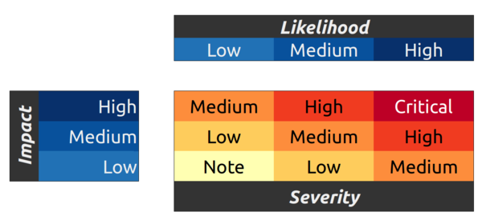

---
metaLinks:
  canonical: >-
    https://app.gitbook.com/s/T3jW1MHeHRSCtkN5uBiY/developer-resources/bug-bounty
---

# Bug Bounty


We are receiving a greatly increased number of bug bounty submissions with the recent surge of AI assisted auditing. Responses to bug bounty submissions may be delayed, so please bear with us whilst we resolve backlog.


The Flaunch Bounty program rewards users that discover and properly disclose found bugs with predefined bounties. We encourage anyone to help strengthen the protocol by actively searching for bugs in the Flaunch contracts.

The Flaunch Bounty program is derived from the Ethereum Bounty Program, an industry standard when it comes to rightfully rewarding bug bounty hunters.

Please send vulnerability submissions to [bounty@flayer.io](mailto:bounty@flayer.io).

## Rules and Rewards

Please have a look at the bullets below before starting your hunt!

* Issues that have already been submitted by another user, or are already known to the Flaunch team, are not eligible for bounty rewards.
* Only bugs found in deployed and utilised mainnet contracts, or code found in the `main` branch of the codebase will be eligible. Some contracts in the `main` branch may not be deployed or planned to be used, so applicability will be determined at the Flaunch team's discretion.
* Public disclosure of a vulnerability makes it ineligible for a bounty.
* You can start or fork a private chain for bug hunting. Please respect the Flaunch main and test networks and refrain from attacking them.
* All paid Flaunch and Flayer Labs members are not eligible for rewards.
* Flaunch websites and organizational infrastructure in general, are NOT part of the bounty program.
* The Flaunch Bounty program considers a number of variables in determining rewards. Determinations of eligibility, score and all terms related to an award are at the sole and final discretion of the Flaunch team.

The value of rewards paid out will vary depending on Severity. The severity is calculated according to the [OWASP](https://www.owasp.org/index.php/OWASP_Risk_Rating_Methodology) risk rating model based on Impact and Likelihood:

<figure><figcaption>
Severity Calculation Table
</figcaption></figure>


We are currently only accepting bug bounties that explore vulnerabilities or attacks that would result in a loss of, or restrict access to, funds for either the user or protocol.


Reward sizes are guided by the rules below, but are in the end, determined at the sole discretion of the Flaunch team.

<table><thead><tr><th>Severity</th><th width="446">Max Bounty</th></tr></thead><tbody><tr><td><strong>Critical</strong></td><td>25,000 USDC</td></tr><tr><td><strong>High</strong></td><td>15,000 USDC</td></tr><tr><td><strong>Medium</strong></td><td>10,000 USDC</td></tr><tr><td><strong>Low</strong></td><td>2,000 USDC</td></tr><tr><td><strong>Note / Informational</strong></td><td>500 USDC</td></tr></tbody></table>

Bounties may be paid out in USDC, ETH or $FLAY tokens.

In addition to Severity, other variables are also considered when the Flaunch team decides the score, including (but not limited to):

* **Quality of description.**\
  Higher rewards are paid for clear, well-written submissions.
* **Quality of reproducibility.**\
  Please include test code, scripts and detailed instructions. The easier it is for us to reproduce and verify the vulnerability, the higher the reward.
* **Quality of fix, if included.**\
  Higher rewards are paid for submissions with clear descriptions of how to fix the issue.

\
**Important Legal Information**

The bug bounty program is an experimental and discretionary rewards program for our active Flaunch community to encourage and reward those who are helping to improve the platform. It is not a competition. You should know that we can cancel the program at any time, and awards are at the sole discretion of the Flaunch team. You are responsible for all taxes. All awards are subject to applicable law. Finally, your testing must not violate any law or compromise any data that is not yours.

#### KYC Requirements 

Approved bug bounties with payouts under $10k can be processed fully anonymously, with no personal information collected.

Any bounties above this value require a custom flow through our legal team and a level of KYC will need to be reached in order to process the payment.

#### Bounty Scope 

The above mentioned bug bounty rules and rewards are applicable to all smart contracts that are actively being used and/or promoted by Flaunch.

When in doubt about whether the bug applies to the bounty program, please contact the team by sending an email to [bounty@flayer.io](mailto:bounty@flayer.io).


Flaunch Repository

